# Network Traffic Profiling & Packet Analysis via Centralized Gateway
by Darren Gavriel Suntara

## 1. Objective
The primary objective of this project is to perform centralized network traffic monitoring and analysis (utilizing a router/firewall as the capture point) to distinguish between baseline network communication patterns (e.g., DNS resolution, TCP handshakes, encrypted traffic) and anomalous activities (e.g., failed connections, port scanning). This project simulates a Security Operations Center (SOC) investigation workflow, wherein digital evidence is exported from the network perimeter to an isolated analysis environment. Understanding these fundamental data movement mechanisms across the network provides an essential foundation for developing secure software architectures.

## 2. Lab Environment
The scenario was executed within a decentralized virtual environment (VirtualBox) featuring the following topology:
*   **Central Router/Firewall:** pfSense (Segregating WAN, Attack LAN, and ECorp LAN zones).
*   **ECorp LAN (Victim):** Subnet `10.0.1.0/24`. The monitored client is a Windows 10 VM (`wrk-price`) assigned the IP `10.0.1.2`.
*   **Attack LAN (Analyst/Attacker):** Subnet `10.0.3.0/24`. The analysis and scanning workstation utilizes Kali Linux with the IP `10.0.3.2`.

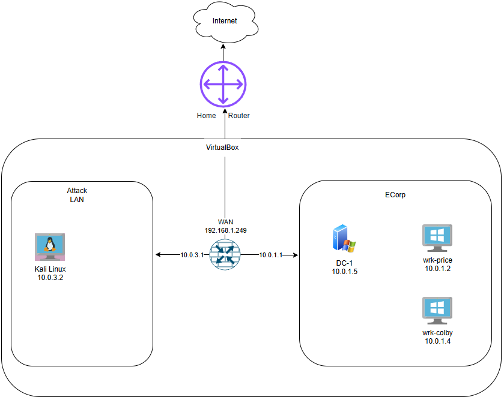

## 3. Tools Used
*   **pfSense (Packet Capture):** Employed for centralized raw packet capture, eliminating the need for additional agent installations on client machines.
*   **Wireshark:** Utilized on the Kali Linux workstation for in-depth inspection and analysis of `.pcap` files.
*   **Nmap:** Used from Kali Linux to generate network traffic anomalies (port scanning).
*   **Command Prompt & Web Browser (Windows 11):** Used on the `wrk-price` machine to generate baseline TCP, HTTP, and DNS traffic.

## 4. Execution & Capture Scenario
During this phase, all ingress and egress traffic concerning the ECorp LAN zone was recorded via pfSense, while various traffic types were generated from both the client and attacker machines.

**Execution Steps:**
1.  **Initiating Capture (From Kali Linux `10.0.3.2`):** Accessed the pfSense web interface (`http://10.0.3.1`), navigated to `Diagnostics > Packet Capture`, selected the ECorp LAN interface, and initiated the capture.
2.  **Generating Baseline Traffic (From Windows `wrk-price` | `10.0.1.2`):**
    *   Executed `nslookup neverssl.com` via Command Prompt.
    
    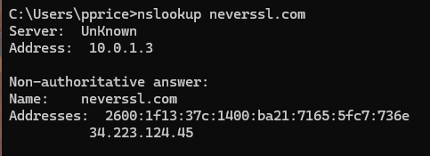

    *   Accessed `http://neverssl.com` (HTTP) and `https://github.com` (HTTPS) via a web browser.
3.  **Generating Scanning Anomalies (From Kali Linux `10.0.3.2`):**
    *   **Targeted Probing:** Simulated an attacker testing whether the victim's Remote Desktop port (3389) was open using Netcat: `nc -nvz 10.0.1.2 3389`.
    
    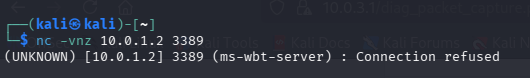

    *   **Port Scan:** Following the failed specific probe, a broad scan was initiated using Nmap: `nmap -sS -F 10.0.1.2`.
    
    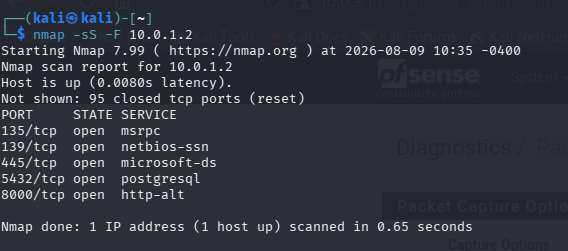

4.  **Evidence Export:** Returned to pfSense, halted the Packet Capture, and downloaded the resulting `.pcap` file for local investigation using Wireshark on the Kali Linux machine.

## 5. Evidence & Analysis
The `.pcap` file was imported into Wireshark on Kali Linux. Display Filters were applied to isolate specific events from the network logs.

### A. DNS (Domain Name System) Resolution Analysis
*   **Analysis Method:** Applied the filter `dns.qry.name == "neverssl.com"`.
*   **Evidence Found:** Traffic was observed from the client IP `10.0.1.2` (`wrk-price`) to the DNS server.
    
    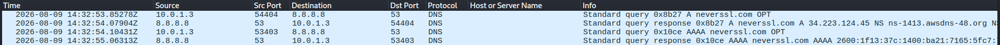

    *   The first packet is a query from the client to the DNS server, requesting the translation of the domain into an IPv4 address (Type A).
    
    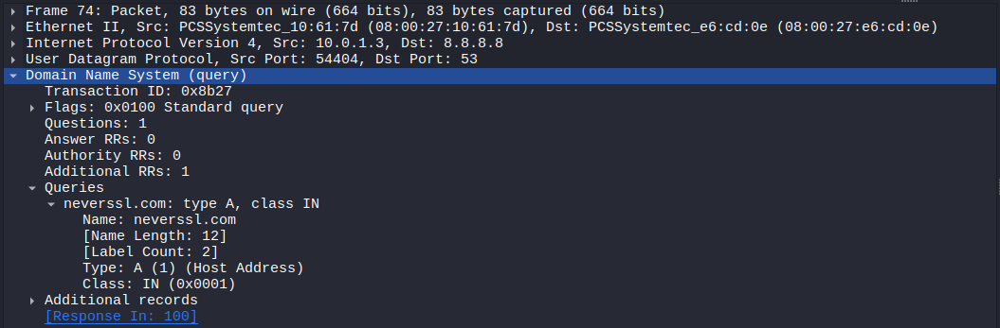

    *   The second packet is the DNS Server's response, providing the IPv4 address for `neverssl.com` (`34.223.124.45`).
    
    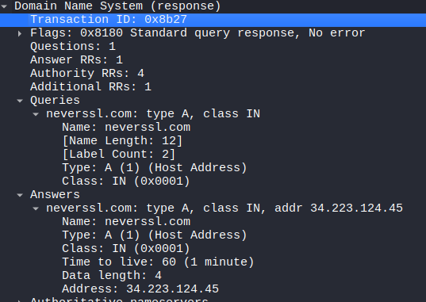

    *   The third packet is a query requesting translation to an IPv6 address (Type AAAA).
    
    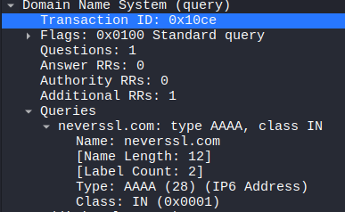

    *   The fourth packet is the response providing the IPv6 address (`2600:1f13:37c:1400:ba21:7165:5fc7:736e`).
    
    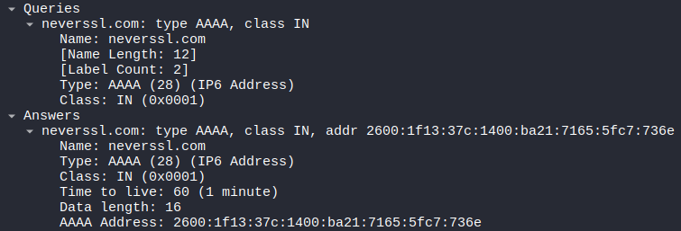

*   **Conclusion:** This traffic illustrates the communication flow between a client and a DNS server to resolve domains into IP addresses (both IPv4 and IPv6). It is also evident that these packets are plaintext and unencrypted.

### B. Comparison of HTTP (Cleartext) and HTTPS (Encrypted) Traffic
*   **Analysis Method:**
    *   Applied the `http` filter and used "Follow TCP Stream" on the web server connection.
    *   Subsequently, applied `tls.handshake.type == 1` to inspect the `Client Hello` connection in the HTTPS session.

*   **Evidence Found:**
    *   Within the HTTP stream, the request structure (HTTP GET) and the server's response (containing the webpage's HTML code) are transparently readable.
    
    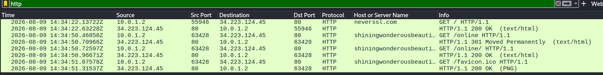

    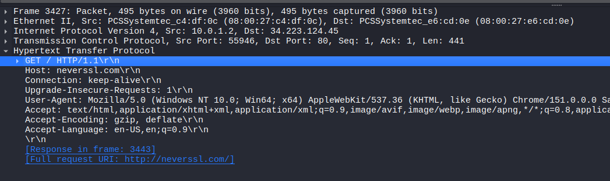

    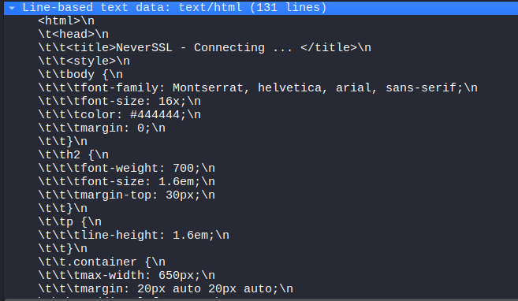

    *   Conversely, following the TCP stream for the HTTPS session reveals that the traffic payload is encrypted and unreadable.
    
    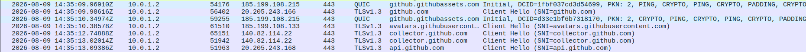

    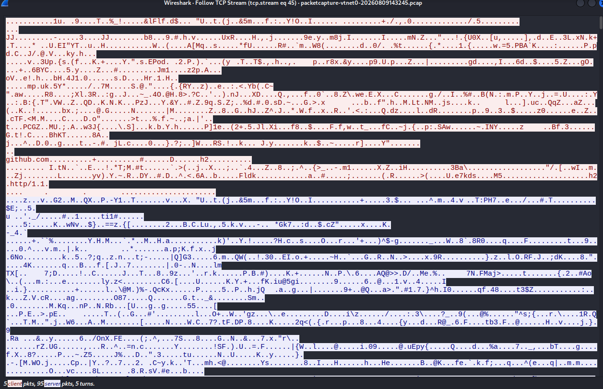

*   **HTTPS Futher Analysis:** While the payload is encrypted, a SOC analyst can still passively identify the destination domain (e.g., `github.com`) by examining the Server Name Indication (SNI) extension within the `Client Hello` packet, which is transmitted in plaintext prior to full encryption. Decrypting this traffic would require a Man-in-the-Middle (MiTM) approach during capture to obtain the KeysLog utilized by the TLS protocol.

### C. Connection Refusal Analysis (TCP Reset on Targeted Probe)
*   **Analysis Method:** Utilized the filter `tcp.flags.reset==1`, combined with the source IP `10.0.3.2` and destination IP `10.0.1.2` on port 3389.
    
    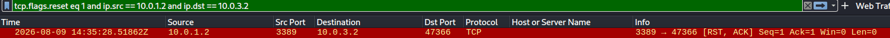

*   **Evidence Found:** The analysis revealed a connection attempt (SYN) from the attacker targeting port 3389. Because the service was inactive on the victim machine, the firewall or OS automatically protected itself by explicitly rejecting the connection, returning an `[RST, ACK]` response to the attacker.
    
    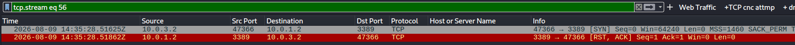

*   **Analysis:** This definitive `[RST, ACK]` response confirms that port 3389 actively refused the connection. In a SOC operational context, detecting repeated RST responses from sensitive ports like RDP often serves as an early indicator of Targeted Probing or vulnerability scanning by unauthorized entities.

### D. Anomaly Identification: TCP SYN Port Scan
*   **Analysis Method:** Filtered for `tcp.flags.syn==1 && tcp.flags.ack==0`.
*   **Evidence Found:** An extreme surge of SYN packets originating from the attacker IP (`10.0.3.2`) directed at the client IP was observed. These packets attempted to open connections to numerous different destination ports sequentially within less than a second, totaling 102 connection attempts. This is a definitive signature of automated scanning utilizing tools like Nmap (Stealth Scan).
    
    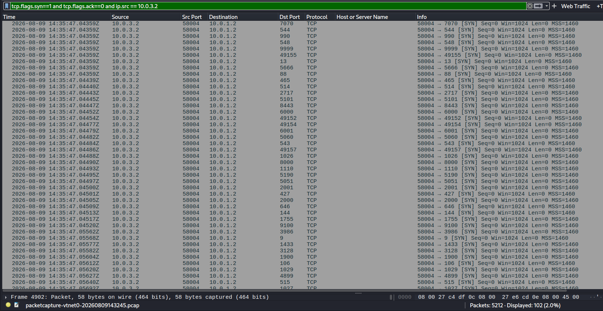

*   **Analysis:** Following the TCP stream on port 445 reveals the characteristic Nmap TCP flow. The attacker sends a SYN to port 445. Because the port is open, Windows responds with a SYN-ACK packet. Instead of completing the 3-way handshake with an ACK packet, Nmap sends an RST packet to abort the handshake.
    
    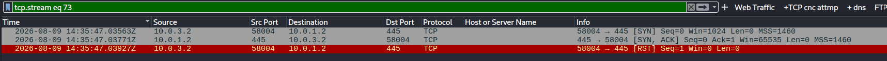

    *   Unlike the Targeted Probe scenario (Section C) where the victim machine sent the `[RST, ACK]` due to a closed port, in this Nmap scenario, **the attacker (Kali Linux) intentionally sends the RST** after receiving the `[SYN, ACK]`. This non-standard manipulation of TCP flags (deviating from RFC) is specifically designed to map open ports without generating entries in the operating system's application connection logs.

## 6. Key Learnings
*   **The Power of Centralized Log Collection:** Capturing packets directly at the gateway (pfSense) provides comprehensive, reliable visibility into North-South traffic, mitigating the risk of manipulation by potentially compromised client machines.
*   **Visibility vs. Data Security:** This project practically demonstrates the vulnerability of cleartext protocols (HTTP, standard DNS) to sniffing techniques, validating the critical role of SSL/TLS in safeguarding application payload confidentiality.
*   **Early Threat Identification:** I learned that fundamental network anomalies, such as port scanning, generate highly "noisy" and identifiable signatures—specifically anomalous TCP flag parameters—that can be readily detected when analysts understand the corresponding search patterns.
